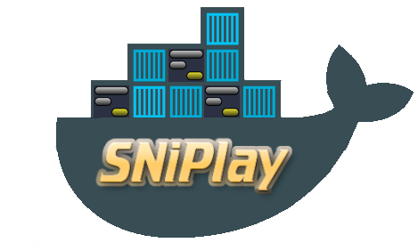

SNP analysis Workflows on Docker
================================

[](http://www.southgreen.fr/)
[](http://sniplay.southgreen.fr/cgi-bin/home.cgi)

**This container present two workflows:**

- SNiPlay3 complete workflow: a package for exploration and large scale analyses of SNP polymorphisms (filtering, SNP density, diversity, linkagedisequilibrium) (Dereeper et al, 2015)
- Haplotype analysis workflow 

[](http://sniplay.southgreen.fr/cgi-bin/home.cgi)
[](http://southgreen.fr/content/haplophyle-tool)

*This documentation is mostly inspired by the [galaxy-rna-workbench documentation](https://github.com/bgruening/galaxy-rna-workbench) hosted by [Björn Grüning](https://github.com/bgruening).*

- [Usage](#usage)
  - [Requirement](#requirement)
  - [Container launch](#container-launch)
  - [Users and passwords](#users-and-passwords)
- [Available tools](#available-tools)
  - [Tools](#tools)
  - [Workflow](#workflow)
- [Contributors](#contributors)

# Usage

This Sniplay container implements a webserver based on the [Galaxy Docker](https://github.com/bgruening/docker-galaxy-stable) platform: a dedicated Galaxy instance wrapped in a Docker container. For advanced local deployments, we recommend to check out the upstream [documentation](http://bgruening.github.io/docker-galaxy-stable).
<p align="right"><a href="#top">&#x25B2; back to top</a></p>

## Requirement

To use the Sniplay container, you only need [Docker](https://www.docker.com/products/overview#h_installation), which can be installed in different ways, depending on the type of system you're running:
- non-linux users are encouraged to use [Kitematic](https://kitematic.com), which provides a Docker installation for [OSX](https://github.com/bgruening/galaxy-rna-workbench/blob/master/howto_kitematic_osx.md) or [Windows](https://github.com/bgruening/galaxy-rna-workbench/blob/master/howto_kitematic_win.md), coupled with a user friendly interface to run Docker containers;
- linux users and people familiar with the command line can follow the instruction on installing Docker from its [website](https://docs.docker.com/installation).
<p align="right"><a href="#top">&#x25B2; back to top</a></p>

## Container launch

### Using Kitematic

Kitematic users can launch the container directly from its interface.

### Without Kitematic

#### With the Quay.io image

The docker-galaxy-sniplay images is hosted in [Quay.io](https://quay.io), a container hosting company

You just need to start the Docker image:

```
$ docker run -p 8080:80 quay.io/valentinmarcon/docker-galaxy-sniplay
```
- `docker run` starts the Image/Container

   In case the Container is not already stored locally, docker downloads it automatically

- The argument `-p 8080:80` makes the port 80 (inside of the container) available on port 8080 on your host

    Inside the container a Apache web server is running on port 80 and that port can be bound to a local port on your host computer.
    With this parameter **you can access your Galaxy instance via `http://localhost:8080`** immediately after executing the command above

- `-d` will start the docker container in Daemon mode.

- `quay.io/valentinmarcon/docker-galaxy-sniplay` is the Image/Container name.

#### With the Dockerfile recipe of this repository

You need to build and start the Docker image.

*Build:*

```
$ cd docker-galaxy-sniplay
$ docker build -t galaxy-sniplay .
```

- `docker build` create an image of the container from the Dockerfile recipe of the repository

- `galaxy-sniplay` is the Image/Container name.

*Start:*

```
$ docker run -d -p 8080:80 galaxy-sniplay
```

---

For an interactive session, one executes:

```
$ docker run -i -t -p 8080:80 quay.io/valentinmarcon/docker-galaxy-sniplay /bin/bash
```

and manually invokes the `startup` script to start PostgreSQL, Apache and Galaxy.

A detailed discussion of Docker's parameters is given in the [Docker manual](http://docs.docker.io/). 

Docker images are "read-only". All changes during one session are lost after restart. This mode is useful to present Galaxy to your colleagues or to run workshops with it.

To install Tool Shed repositories or to save your data, you need to export the calculated data to the host computer. Fortunately, this is as easy as:

```
$ docker run -d -p 8080:80 -v /home/user/galaxy_storage/:/export/ quay.io/valentinmarcon/docker-galaxy-sniplay
```

Given the additional `-v /home/user/galaxy_storage/:/export/` parameter, docker will mount the folder `/home/user/galaxy_storage` into the Container under `/export/`. A `startup.sh` script, that is usually starting Apache, PostgreSQL and Galaxy, will recognize the export directory with one of the following outcomes:

- In case of an empty `/export/` directory, it will move the [PostgreSQL](http://www.postgresql.org/) database, the Galaxy database directory, Shed Tools and Tool Dependencies and various configure scripts to /export/ and symlink back to the original location.
- In case of a non-empty `/export/`, for example if you continue a previous session within the same folder, nothing will be moved, but the symlinks will be created.

This enables you to have different export folders for different sessions - meaning real separation of your different projects.

It will start the Sniplay container with the configuration and launch of a Galaxy instance and its population with the needed tools. The instance will be accessible at [http://localhost:8080](http://localhost:8080).

> For a more specific configuration, you can have a look at the [documentation of the Galaxy Docker Image](http://bgruening.github.io/docker-galaxy-stable/) by Björn A. Grüning .

<p align="right"><a href="#top">&#x25B2; back to top</a></p>

## Users and passwords

The Galaxy Admin User has the username `admin@galaxy.org` and the password `admin`.
In order to use the Workflow one has to be logged in.
Also the installation of additional tools requires a login.

The PostgreSQL username is `galaxy`, the password `galaxy` and the database name `galaxy`.

If you want to create new users, please make sure to use the `/export/` volume. Otherwise your user will be removed after your docker session is finished.
<p align="right"><a href="#top">&#x25B2; back to top</a></p>

# Available tools

In this section we list all tools that have been integrated in the Sniplay container.

## Tools
Tool | Description | Owner
--- | --- | ---
[FastME](https://toolshed.g2.bx.psu.edu/view/dereeper/fastme/) | A distance based phylogeny reconstruction algorithm | dereeper
[MLMM](https://toolshed.g2.bx.psu.edu/view/dereeper/mlmm/) | Multi-Locus Mixed-Model (MLMM) for GWAS analysis | dereeper
[PLINK](https://toolshed.g2.bx.psu.edu/view/dereeper/plink/) | Filter large VCF genotyping file | dereeper
[Readseq](https://toolshed.g2.bx.psu.edu/view/dereeper/readseq/) | Convert various alignment formats | dereeper
[sNMF](https://toolshed.g2.bx.psu.edu/view/dereeper/snmf/) | Fast and efficient program for estimating individual ancestry coefficients | dereeper
[SnpEff](https://toolshed.g2.bx.psu.edu/view/dereeper/snpeff_from_gff_vcf/) | SNP annotation : coding/non-coding, synonymous/non-synonymous | dereeper
[SnpSift Filter](https://toolshed.g2.bx.psu.edu/view/iuc/snpsift/) |  Filter variants using arbitrary expressions (from  Pablo Cingolani) | iuc 
[Tassel](https://toolshed.g2.bx.psu.edu/view/dereeper/tassel5/) | Evaluate traits associations, evolutionary patterns, and linkage disequilibrium | dereeper
[VCFtools Filter,Stats,Diversity](https://toolshed.g2.bx.psu.edu/view/dereeper/vcftools_filter_stats_diversity/) | Subset of VCFtools fonctionalities : Filtering, Statistics, Diversity (slidingWindow) | dereeper
 | | 
[beagle](https://toolshed.g2.bx.psu.edu/view/dereeper/beagle/) | Performs genotype calling, genotype phasing, imputation of ungenotyped markers, and identity-by-descent segment detection  | dereeper
[haplophyle](https://toolshed.g2.bx.psu.edu/view/dereeper/haplophyle/) | Create haplotype network from haplotype sequences  | dereeper
[cytoscape](https://toolshed.g2.bx.psu.edu/view/dereeper/cytoscape/) |  Visualize interaction networks from JSON file  | dereeper
 | | 
[Sniplay](https://toolshed.g2.bx.psu.edu/view/dereeper/sniplay/) | SNiPlay3: a package for exploration and large scale analyses of SNP polymorphisms (filtering, density, vcftools, diversity, linkagedisequilibrium, GWAS) (does not include external tools) **> See below <** | dereeper

### Sniplay

[Sniplay](https://toolshed.g2.bx.psu.edu/view/dereeper/sniplay/) is a package of 11 tools:

Tool | Description 
--- | --- 
[SNP density](https://toolshed.g2.bx.psu.edu/repository/display_tool?repository_id=96051612dc5f86b2&render_repository_actions_for=tool_shed&tool_config=%2Fsrv%2Ftoolshed%2Fmain%2Fvar%2Fdata%2Frepos%2F001%2Frepo_1472%2FSNP_density%2FcalculateSlidingWindowsSNPdensitiesFromVCF_wrapper.xml&changeset_revision=c6640c49fd01) | Calculate SNP densities along chromosome from a VCF input
[Rooting](https://toolshed.g2.bx.psu.edu/repository/display_tool?repository_id=96051612dc5f86b2&render_repository_actions_for=tool_shed&tool_config=%2Fsrv%2Ftoolshed%2Fmain%2Fvar%2Fdata%2Frepos%2F001%2Frepo_1472%2FRooting%2Frooting.xml&changeset_revision=c6640c49fd01) | Midpoint rooting of newick tree
[Diversity by gene](https://toolshed.g2.bx.psu.edu/repository/display_tool?repository_id=96051612dc5f86b2&render_repository_actions_for=tool_shed&tool_config=%2Fsrv%2Ftoolshed%2Fmain%2Fvar%2Fdata%2Frepos%2F001%2Frepo_1472%2Fegglib%2FCalculateDiversityIndexes.xml&changeset_revision=c6640c49fd01) | Calculates various diversity indexes with EggLib
[HapmaptoMLMMFiles](https://toolshed.g2.bx.psu.edu/repository/display_tool?repository_id=96051612dc5f86b2&render_repository_actions_for=tool_shed&tool_config=%2Fsrv%2Ftoolshed%2Fmain%2Fvar%2Fdata%2Frepos%2F001%2Frepo_1472%2Fhapmap2mlmm%2FHapmapToMLMMFiles.xml&changeset_revision=c6640c49fd01) | Converts a hapmap file into MLMM input files
[Get Haplotypes From Phased VCF](https://toolshed.g2.bx.psu.edu/repository/display_tool?repository_id=96051612dc5f86b2&render_repository_actions_for=tool_shed&tool_config=%2Fsrv%2Ftoolshed%2Fmain%2Fvar%2Fdata%2Frepos%2F001%2Frepo_1472%2FGetHaplotypesFromPhasedVCF%2FgetHaplotypesFromPhasedVCF.xml&changeset_revision=c6640c49fd01) | Get Haplotypes From Phased VCF
[Ped2Fasta](https://toolshed.g2.bx.psu.edu/repository/display_tool?repository_id=96051612dc5f86b2&render_repository_actions_for=tool_shed&tool_config=%2Fsrv%2Ftoolshed%2Fmain%2Fvar%2Fdata%2Frepos%2F001%2Frepo_1472%2FPedToFasta%2FpedToFasta.xml&changeset_revision=c6640c49fd01) | Convert PED file to Fasta File
[PLINK: ped2bed](https://toolshed.g2.bx.psu.edu/repository/display_tool?repository_id=96051612dc5f86b2&render_repository_actions_for=tool_shed&tool_config=%2Fsrv%2Ftoolshed%2Fmain%2Fvar%2Fdata%2Frepos%2F001%2Frepo_1472%2Fped2bed%2Fped2bed.xml&changeset_revision=c6640c49fd01) | Convert ped to bed
[Get VCF annotation statistics](https://toolshed.g2.bx.psu.edu/repository/display_tool?repository_id=96051612dc5f86b2&render_repository_actions_for=tool_shed&tool_config=%2Fsrv%2Ftoolshed%2Fmain%2Fvar%2Fdata%2Frepos%2F001%2Frepo_1472%2FAnnotationStatsFromVCF%2FannotationStatsFromVCF_wrapper.xml&changeset_revision=c6640c49fd01) | Get annotation fromi a VCF file annotated by snpeff
[Check GWAS Inputs](https://toolshed.g2.bx.psu.edu/repository/display_tool?repository_id=96051612dc5f86b2&render_repository_actions_for=tool_shed&tool_config=%2Fsrv%2Ftoolshed%2Fmain%2Fvar%2Fdata%2Frepos%2F001%2Frepo_1472%2Fcheck_gwas_inputs%2FCheckGWASInputs.xml&changeset_revision=c6640c49fd01) | Checks concordance between input files for GWAS analysis
[VCF to Hapmap](https://toolshed.g2.bx.psu.edu/repository/display_tool?repository_id=96051612dc5f86b2&render_repository_actions_for=tool_shed&tool_config=%2Fsrv%2Ftoolshed%2Fmain%2Fvar%2Fdata%2Frepos%2F001%2Frepo_1472%2FVCF2Hapmap%2Fvcf2FastaAndHapmap.xml&changeset_revision=c6640c49fd01) | Convert VCF to Hapmap
[PLINK: MDS plot](https://toolshed.g2.bx.psu.edu/repository/display_tool?repository_id=96051612dc5f86b2&render_repository_actions_for=tool_shed&tool_config=%2Fsrv%2Ftoolshed%2Fmain%2Fvar%2Fdata%2Frepos%2F001%2Frepo_1472%2FMDSplot%2Fmdsplot.xml&changeset_revision=c6640c49fd01) | IBS matrix / multi-dimensional scaling

<p align="right"><a href="#top">&#x25B2; back to top</a></p>

## Workflows

Name | Description 
--- | --- 
[sniplay3_complete_workflow](https://toolshed.g2.bx.psu.edu/view/dereeper/sniplay3_complete_workflow/) | SNiPlay3 complete workflow: a package for exploration and large scale analyses of SNP polymorphisms (filtering, density, vcftools, diversity, linkagedisequilibrium, GWAS) (all SNiPlay3 components) 

[](https://toolshed.g2.bx.psu.edu/view/dereeper/sniplay3_complete_workflow/)

Name | Description 
--- | --- 
[haplotype_analysis_workflow](https://toolshed.g2.bx.psu.edu/view/dereeper/haplotype_analysis_workflow/) |  Haplotype analysis workflow 

[](https://toolshed.g2.bx.psu.edu/view/dereeper/haplotype_analysis_workflow/)

<p align="right"><a href="#top">&#x25B2; back to top</a></p>

# Contributors

 - [Valentin Marcon](https://github.com/ValentinMarcon)
 - [Alexis Dereeper](https://github.com/dereeper)

<p align="right"><a href="#top">&#x25B2; back to top</a></p>


